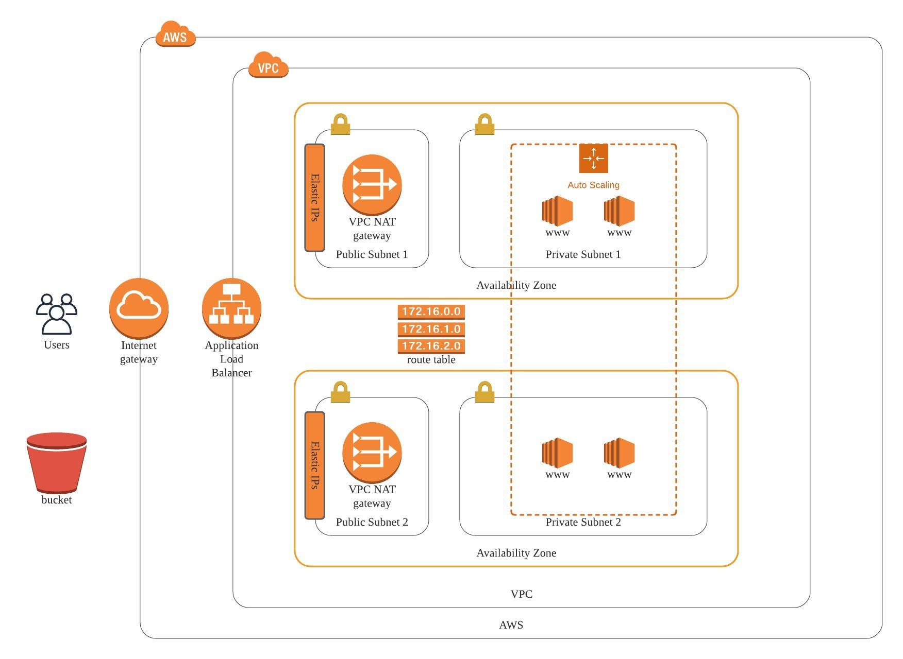

# Deploy-web-app-using-CloudFormation

The project is for Udacity DevOps Nanodegree. The project is to practice deploying Infrastructure as code. The syllabus is [here](https://d20vrrgs8k4bvw.cloudfront.net/documents/en-US/Cloud+DevOps+Nanodegree+program+Syllabus.pdf)

## Introduction

We deploy an application (Apache Web Server) and also pick up code (JavaScript and HTML) from S3 Storage and deploy it in the appropriate folder on the web server.



We can deploy the app (in us-west-2 region) by running commands:

```
./create.sh udagram-infra udagram-infra.yml udagram-infra-parameters.json
./create.sh udagram-server udagram-server.yml udagram-server-parameters.json
```

## Stack

- AWS CloudFormation
